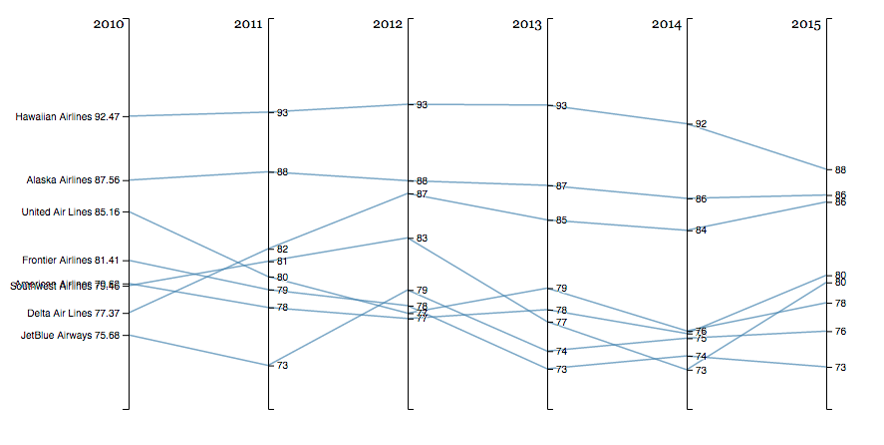
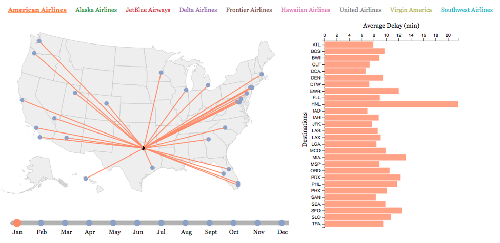
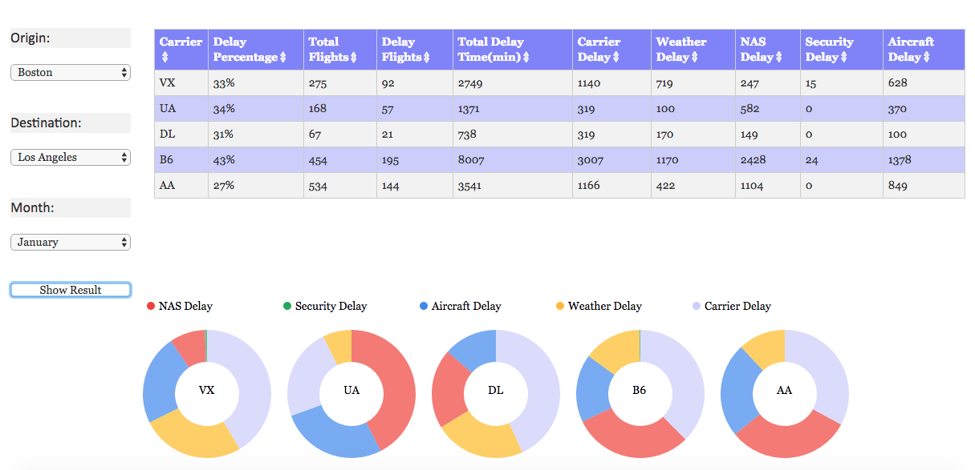
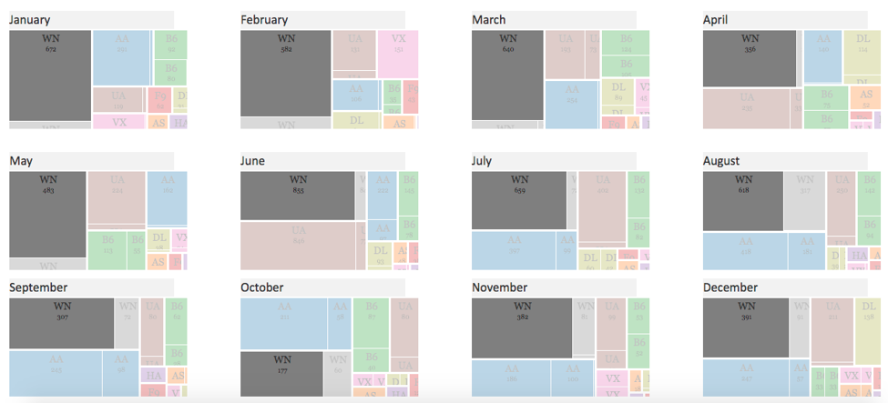

# Flight_Delay_Checking_System

Project link: ["Project Link"](https://jacysun.github.io/Flight_Delay_Checking_System/index.html)

# Overview 

Air travel has become widely available to travellers in the US. Delays and cancellations by major airlines causes a lot of problems for travellers. We want to give viewers a tool to make an informed decision about the airline, airport, time of travel etc. that they choose, based on historical flight data. 
We narrowed out scope to 30 major airports according to their rank in number of flights.
We wrote script to filtered out and training the flights with origin or destination that we are not interested in. 
For the on time data for the parallel coordinates plot and the cancellation data for the treemap, we used python to group together the data by airline and years.

# Design Achievements
We used four kinds of chart to present the delay and cancel information for 30 major aiports:

The first visualization is a Parallel Coordinate plot showing the flight ontime arrival performance of nine major carriers from year 2010 to 2015.

Non-obvious features: Click each line to highlight the specific information.

The second visualization is a Map showing the flight routes and their average delay time for a specific month of a specific carrier, which is the average of the past 6 years from 2011 to 2016.

Non-obvious features: Click carries and month and hover over or click to check average delay information of the carrier during a perticular month.

The third visualization is a Table  and donut chart that allows user specify origin, destination and the month. 

Non-obvious features: After clicking the show button,click columns to sort the carriers in ascending or descending order. 
And donut charts will desplay the proportions of flight delay causes,each one representing a carrier. This segment gets updated every time the metrics change.

The final visualization we implemented a grid of treemaps.Each treemap represents one month of the year. The individual tiles represent the proportion of each cause of cancellation.  

Non-obvious features: Hovering over the tiles highlights that particular cause and carrier across all the other treemaps as well

